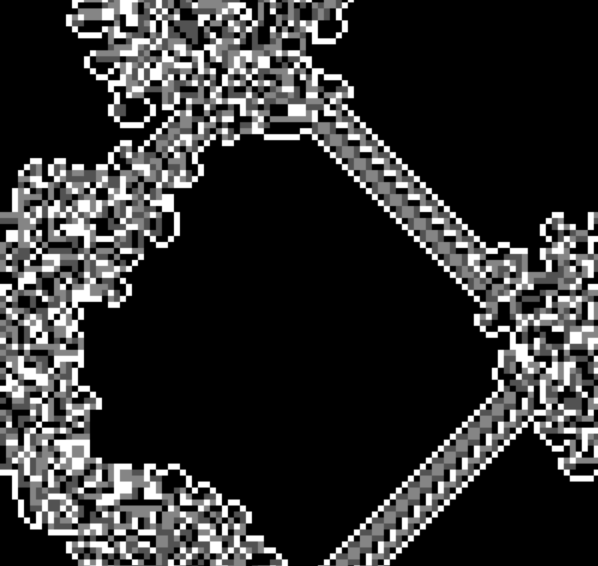

# langtons-ant

this is a simple visualization of langton's ant that i coded for fun. to make it a little more interesting i added two more colors and a function that allows the ant to move diagonally too. the spawn position of the ant is random and it warps around the window which creates really cool effects.

## previews

### traditional version:

### diagonal movement on one color:

